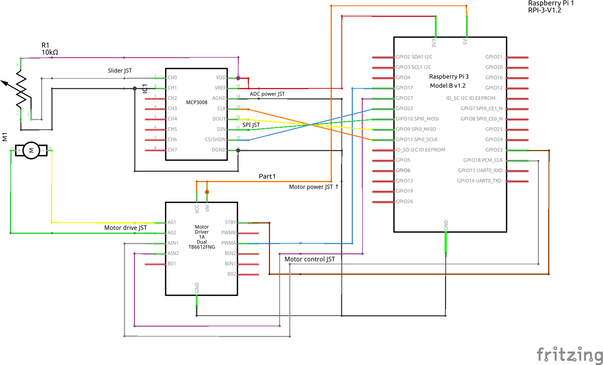

# The Bio Box

## Audio slider control for Raspberry Pi

This project arose out of the desire for a smooth volume control interface for
various sources, especially when livestreaming. Inspired by digital sound desks,
this project allows use of a motorised slider to smoothly adjust a number of
audio or analog sources, such as:

- OBS: Mic, desktop capture, other inputs
- VLC
- Media in Chrome - see unpacked extension in VolumeSocket
- Webcam focus and exposure
- Pulseaudio - TODO

BioBox can be run on a PC without any kind of analog slider, but its usefulness
will be limited. You still have the benefit of multiple sources controlled in
one place, but adjustment is still done by click-dragging or scrolling.

Dependencies:
=============

Hardware:
- Raspberry Pi B2, B3, B3+, B4 or 400 (tested on B4 only)
- Bourns PSM01-082A-103B2 motorized slide potentiometer 10kΩ
- MCP3008 analog-to-digital converter (ADC)
- TB6612FNG motor controller board
- Breadboard or breadboard layout PCB - 20 rows minimum
- Prototyping plug-to-socket wires
- Short wires for links on breadboard
- JST connectors and sockets for permanent installation
Alternative hardware may be used at the user's discretion, however all low-level
software is based on this implementation.

Software:
- Modern GNU/Linux system with GUI
- `python3-gi` from your package manager
- Python packages as per `requirements.txt`:
  - `gbulb` - Required to run main event loop
  - `adafruit-blinka` and `adafruit-circuitpython-mcp3xxx` - for interfacing with slider
  - `RPi.GPIO` - for motor driver in Motor.py
  - `websockets` - for connecting to OBS and browser extension
  - `v4l2py` - for interfacing with webcams
- [TellMeVLC](https://github.com/Rosuav/TellMeVLC) for VLC integration
- OBS 28+ for OBS integration

Setup:
======

SPI must be enabled to connect to the ADC. This can be done with `raspi-config`
(see [here](https://raspberrypi.stackexchange.com/a/47398/134450) for installation
instructions) or by following [these instructions](https://www.raspberrypi.org/documentation/hardware/raspberrypi/spi/README.md#software).

1. Install dependencies as required for the modules/features you intend to run
2. Copy `config_example.py` to `config.py` and change values as required (some values explained below)
3. For VLC integration, see [TellMeVLC](https://github.com/Rosuav/TellMeVLC)
4. For OBS integration, OBS -> Tools -> WebSocket Server Settings -> Enable WebSocket server, copy port number and password (if applicable) into config.py

TODO: finish writing (ie webcam)

Wiring:
=======

The slider cannot simply connect directly to the Pi for two main reasons. First,
the slider is an analogue component, but the Pi has no analogue inputs. Second,
Pi GPIO pins cannot deliver sufficient power to connect the motor directly to
two GPIO pins - the motor may function, but the speed will be painfully slow.

The solutions to these problems are to add two chips in between the slider and
the Pi - the ADC for the slider, and the motor controller for the motor.

The MCP3008 uses the SPI interface to connect to a controller (see Setup to make
sure SPI is enabled on the Pi). The ADC will need power, ground and four SPI
connections to the Pi, and three* to the slider. You can cross-reference the
connection list below with the [MCP3008 datasheet](https://cdn-shop.adafruit.com/datasheets/MCP3008.pdf).

* The ADC really needs only one connection to the slider, but the slider also
needs power and ground, which may be convenient to connect to the board from the
ADC.

The motor controller uses two pins to determine direction, a PWM pin to control
speed, and a standby pin to enable or disable the motor entirely, in addition to
power and ground, each for itself and the motor.

TODO: Explain

- MCP3008 connections:
	- CH0  -> Slider 2'
	- CH1  -> Slider 1', GND
	- CH2  unused
	- CH3  unused
	- CH4  unused
	- CH5  unused
	- CH6  unused
	- CH7  unused
	- DGND -> Pi GND  (pin 25)
	- CS   -> Pi GP22 (pin 15)
	- DIN  -> Pi MOSI (pin 19)
	- DOUT -> Pi MISO (pin 21)
	- CLK  -> Pi SCLK (pin 23)
	- AGND -> Pi GND  (pin 25)
	- VREF -> Pi 3.3V (pin 17)
	- VDD  -> Pi 3.3V (pin 17)

- Slider connections:
	- A  -> TB6 A02
	- B  -> TB6 A01
	- 3 unused
	- 2 unused
	- 1 unused
	- T unused
	- 1' -> MCP CH1 (pin 2)
	- 2' -> MCP CH0 (pin 1)
	- 3' -> MCP VDD (pin 16)

- TB6612FNG connections:
	- VM   -> Pi +5V  (pin 2)
	- VCC  -> Pi +5V  (pin 2)
	- GND1 unused
	- A01  -> Slider B (black)
	- A02  -> Slider A (red)
	- B02  unused
	- B01  unused
	- GND2 -> Pi GND  (pin 9)
	- GND3 unused
	- PWMB unused
	- BIN2 unused
	- BIN1 unused
	- STBY -> Pi GP23 (pin 16)
	- AIN1 -> Pi GP18 (pin 12)
	- AIN2 -> Pi GP27 (pin 13)
	- PWMA -> Pi GP17 (pin 11)
