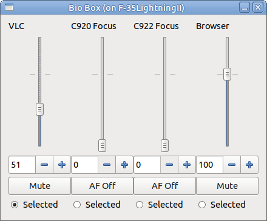

# The Bio Box

## Audio slider control for Raspberry Pi



This project arose out of the desire for a smooth volume control interface for
various sources, especially when livestreaming. Inspired by digital sound desks,
this project allows use of a motorised slider to smoothly adjust a number of
audio or analog sources, such as:

- OBS: Mic, desktop capture, other inputs - TODO
- VLC
- Media in Chrome - see unpacked extension in VolumeSocket
- Webcam focus

Reference hardware uses a motorized 10kΩ slide potentiometer from [SparkFun](https://www.sparkfun.com/products/10976)
with the potentiometer attached to a MCP3008 analog-to-digital converter (ADC),
and the motor connected to a TB6612FNG motor controller. See [Wiring](#wiring)
for details on where to connect everything.

TODO: Find how to keep track of RPi "low power" mode (correlated with bolt icon
on display) over SSH. Also try running headless to reduce power usage.
20211009: Running with the screen unpowered does reduce the amount of time the
Pi spends power limited. Command to watch power limiting:
```watch -n 1 sudo vcgencmd get_throttled```
`throttled=0x50000` means not throttled, and `throttled=0x50005` means power
throttled.

Dependencies:
=============

- `python3-gi` from your package manager
- Python packages as per `requirements.txt`

Setup:
======

SPI must be enabled to connect to the ADC. This can be done with `raspi-config`
(see [here](https://raspberrypi.stackexchange.com/a/47398/134450) for installation
instructions) or by following [these instructions](https://www.raspberrypi.org/documentation/hardware/raspberrypi/spi/README.md#software).

TODO: finish writing

Wiring:
=======

- Analogue input
	- MCP3008 connections:
		- VDD -> 3.3V (pin 17)
		- VREF -> 3.3V (pin 17)
		- AGND -> GND (pin 25)
		- CLK -> SCLK (pin 23)
		- DOUT -> MISO (pin 21)
		- DIN -> MOSI (pin 19)
		- CS -> GPIO #22 (pin 15)
		- DGND -> GND (pin 25)
	- Slider connections:
		- L1 -> R3 ("bragging wire")
		- L2 NC
		- L3 unused
		- L4 unused
		- R1 -> CH0 (MCP pin 1)
		- R2 -> 3.3V (MCP pin 16)
		- R3 -> L1 ("bragging wire")
		- R4 -> GND (MCP pin 9)

The "bragging wire" tells you how great the range of the potentiometer is. The
reason this is necessary for this slider is because the MCP3008 needs the full
range of resistance to be present between +3.3V and GND. For most 3-pin
potentiometers, this is simply done by wiring the outside pins to +3.3v and GND,
and the middle pin to a channel. With this slider, there are two independent
2-pin scales which work in opposite directions. When added together, the scales
always add up to the full range, irrespective of the position of the slider.
Therefore, by linking the opposite scales and measuring one of them, we can
emulate a single 3-pin potentiometer to the MCP3008.

- Motor control
	- TB6612FNG connections:
		- VM -> +5V (pin 2)
		- VCC -> +5V (pin 2)
		- GND 1 unused
		- A01 -> Motor yellow
		- A02 -> Motor green
		- B02 unused
		- B01 unused
		- GND 2 -> GND (pin 9)
		- PWMA -> GPIO 17 (pin 11)
		- AIN2 -> GPIO 27 (pin 13)
		- AIN1 -> GPIO 18 (pin 12)
		- STBY -> GPIO 23 (pin 16)
		- BIN1 unused
		- BIN2 unused
		- PWMB unused
		- GND 3 unused

When slider should snap to a position, set a goal position.
If a goal is set, don't yield to BioBox main.
Calculate difference between current position and goal, and adjust direction
and duty cycle based on table:
if goal < pos, use reverse
for abs(pos - goal): (subject to change)
	>50: speed 100
	>25: speed 75
	>10: speed 50
	>1: speed 25
	Else: stop/apply brake

After reaching goal, it may be necessary to not yield for another two ticks.

Slider rescaling:
=================

The slider claims to be linear, but the actual travel-resistance response is,
while not logarithmic, decidedly non-linear. This is an attempt to use linear
interpolation to fix the resultant values when converted to 0-100% travel.

Observation at 20211002: When 0% cannot reach as low, all values from 0-50% seem
to shift by about the same amount - values were `520 548 578 612 651 698 746`.
At 60% and above, values were within measurement error of original test.
It remains to be seen if this will be consistent. More data required.

```
0:   517
10:  545
20:  575
30:  609
40:  649
50:  695
60:  745
70:  805
80:  873
90:  957
100: 1023
```

After reseating connecting wires from ADC to slider (especially the bragging
wire), floor became 511. More importantly, it seems that *all* values from 0-90%
shifted (Δ ~6), though 90% (Δ 2) may have been measurement error.

```
0:   511
10:  538
20:  569
30:  603
40:  643
50:  689
60:  739
70:  799
80:  869
90:  955
100: 1023
```
